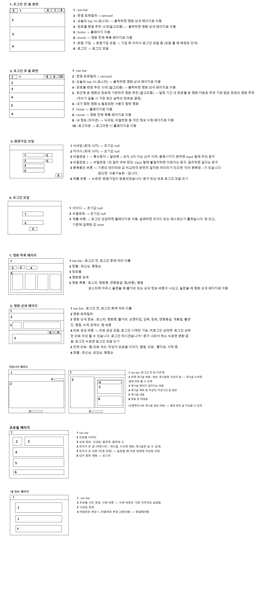

# TicketTailor

*SSAFY 11기 관통 프로젝트 :: 영화 추천 사이트*

**1. 프로젝트 개요**
- - -
 - 프로젝트명 : TicketTailor(티켓 테일러)

 - 프로젝트 개요 : 영화 데이터 기반 추천 웹 서비스 개발, 영화 추천 알고리즘 구현, 커뮤니티 서비스 구성, 서비스 관리 및 유지보수
 
 - 기간 / 인원 : 2024.05 ~ 2024.05 (1주),  2명 
 
 - 기술 / 환경 : Vue, Django, Bootstrap, restAPI

 - 구현 사항
    1.	영화 정보 데이터는 최소 50개 이상 존재, fixtures 사용해 언제든 load 될 수 있는 초기 데이터 있어야 함
    2.	사용자는 반드시 최소 1개 이상의 영화 추천 받을 수 있어야 함, 추천 방식은 자유롭게 구성 가능
    3.	API 사용 제한 없음
    4.	유저간 소통 할 수 있는 커뮤니티

 - ERD
 .png>)

 - 화면 설계
 

 - url / 컴포넌트 구성
 .png>)

---

**2. 팀원 및 업무 분담**

 - 김민영 (팀장)
   + 전반적인 기획 및 일정 관리
   + 로그인 / 회원가입 / 비밀번호 닉네임, 프로필 사진 변경
   + 화면 및 컴포넌트 설계
   + TMDB 데이터 크롤링 후 fixture 제작
   + 프로필 페이지, 리뷰 목록 페이지, 상단바, 메인페이지, 커뮤니티 UI/UX

 - 유지연 (팀원)
   + ERD 설계
   + TMDB 데이터 크롤링 후 fixture 제작
   + 메인 페이지, 영화 목록 페이지, 영화 상세 페이지
   + 커뮤니티 / 댓글 / 팔로우 /팔로잉 / 좋아요 기능 구현
   + 추천 알고리즘, 기준 정렬 구현

---
   
**3. 서비스 설명 및 구현 화면**

 - 컨셉 : TicketTailor는 티켓 재단사라는 의미로, 내가 본 영화를 티켓화하여 기록

 - 타겟층 : 다이어리 꾸미기, 영수증 리뷰와 같이 일상을 기록하는 데에 관심 있는 10~20대

 - 추천 알고리즘
   * 자신이 팔로우한 유저들이 찜한 영화 추천
     + 자신이 관심 있는 유저들을 팔로우하게 되면 그 유저들이 찜한 영화들에 대한 장르를 수집하고, 가장 많이 겹치는 영화 장르 데이터를 기반으로 영화 추천
   * 높은 평점의 리뷰에 따른 영화 추천
     + 자신의 관람 경험을 바탕으로 리뷰를 작성해 0 ~ 10점의 평점 중 높은 평점의 리뷰들의 정보 수집, 중복되는 장르를 기반으로 영화 추천

<video controls src="구현5.mp4" title="Title"></video>
<video controls src="구현11.mp4" title="Title"></video>

---
**4. 느낀 점**
 - 김민영  
 기획 단계에서 기간 내에 할 수 있고, 해보고 싶은 기능을 구현하기 위해 세부적으로 설계 문서를 작성했음에도 프로젝트를 진행하면서 진행 속도 및 과정에 따라 수정이 반복되었는데, 팀원과의 굳건한 신뢰와 원활한 의사소통이 아니었다면 프로젝트를 완성하기 어려웠을 것 같다.
 또, API를 이용해 DB를 dump data로 만드는 과정에서 인코딩 전환 문제에 직면하여 이를 처리하는 역량을 기를 수 있었고, 다양한 에러를 처리하며 백엔드 개발자로서 조금 더 성장할 수 있었다고 생각된다.
 UI/UX 구현은 내가 타겟층이라면 어떨지 시뮬레이션 돌리는 게 중요함을 배우고, 다른 웹 사이트를 분석하는 능력을 키울 수 있었다.  

 - 유지연  
 직접 API를 이용해 데이터를 불러오고 이를 이용해 필요한 데이터로 변환 또는 저장하여 영화사이트를 만들면서 배웠던 내용을 스스로 적용해보며 백엔드의 구조에 대해 자세히 알게된것같다. 프론트에서 백엔드에 요청하여 이를 백엔드에서 처리해 주는 과정을 구현하고 이를 프론트에서 받아 구현하는 과정을 상세히 알게 되어 좋았다. 컴포넌트를 재활용하며 사이트를 공통성있으면서 깔끔하게 구현하여 좋았다. 